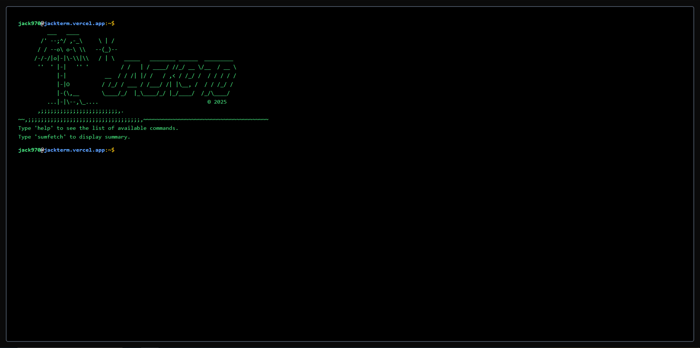

# 💻 TermJack - Terminal Styled Website

Uma aplicação web interativa que simula a experiência de um terminal de comando. Permite ao usuário digitar comandos como se estivesse em um terminal real, com suporte para comandos personalizados e animações de digitação.

## 📸 Showcase

 
<strong>JackTerm Live</strong>

## Índice

- [💻 TermJack - Terminal Styled Website](#-termjack---terminal-styled-website)
  - [📸 Showcase](#-showcase)
  - [Índice](#índice)
  - [Visão Geral](#visão-geral)
  - [Características](#características)
  - [Tecnologias Usadas](#tecnologias-usadas)
  - [Comandos Disponíveis](#comandos-disponíveis)

## Visão Geral

Este projeto cria uma interface de terminal web personalizada, onde os usuários podem interagir com uma simulação de terminal diretamente no navegador. Ele foi criado para ser uma ferramenta divertida e educativa, ideal para desenvolvedores, entusiastas de tecnologia ou qualquer pessoa que queira simular a experiência de usar um terminal dentro de uma página da web.

## Características

- **Interface Estilo Terminal**: A aplicação tem uma interface de terminal clássica, com fundo preto e texto branco.
- **Comandos Personalizados**: O usuário pode digitar e executar comandos personalizados, como `help`, `figlet`, `whoami`, , etc.
- **Simulação de Comandos Linux**: Emula comandos básicos do Linux como `host`, `echo`, e `clear`.

## Tecnologias Usadas

Este projeto é construído com as seguintes tecnologias:

- **Frontend**: [React](https://reactjs.org/), [Next.js](https://nextjs.org/), [Tailwind CSS](https://tailwindcss.com/)
- **TypeScript**: Usado para garantir um desenvolvimento mais robusto e sem erros de tipo.
- **Bibliotecas e Ferramentas**:
  - [Figlet](https://github.com/patorjk/figlet.js) para gerar texto estilizado em ASCII.

## Comandos Disponíveis

- **help**: Mostra a lista de comandos disponíveis.
- **figlet**: Gera um figlet de um texto.
- **echo**: Mostra o texto na saída padrão.
- **whoami**: Retorna o nome do usuário.
- **hostname**: Exibe o nome do host.
- **clear**: Limpa a tela do terminal.
- **date**: Exibe a data e hora atual.
- **banner**: Exibe o banner do terminal.
